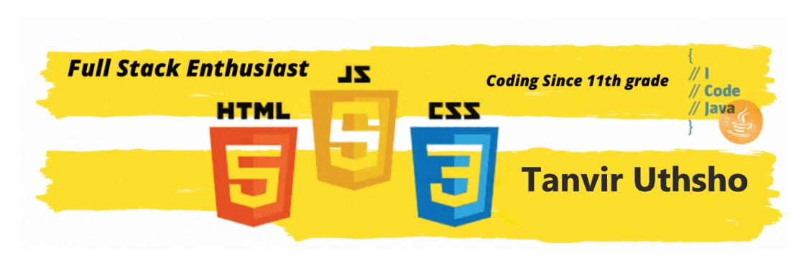

<h3> < Hello world, I'm <a href="https://   " target="_blank"> Tanvir Hossain Uthsho</a> />  </h3>
I am a pre-final year CS student with a great passion for programming. I am trying to create magic with 0's and 1's. The green dots on my GitHub profile show my developer journey. I have experimented with AI, NLP, Blockchain etc but found my niche domain in full stack development.
         

 
 
 <!---->
 
 
 

 
 

<!-- ===================
========================== -->
<h3 align="left">Connect with me:</h3>

<h3 align="left">Languages and Tools 🚀:</h3>

 
  
                       
 
 
                    

 
                     
                    
             
             
                

 
 
 
<h2 align="center">
  My Github Stats
</h2>
 
 

  
  

 

 

 

 
